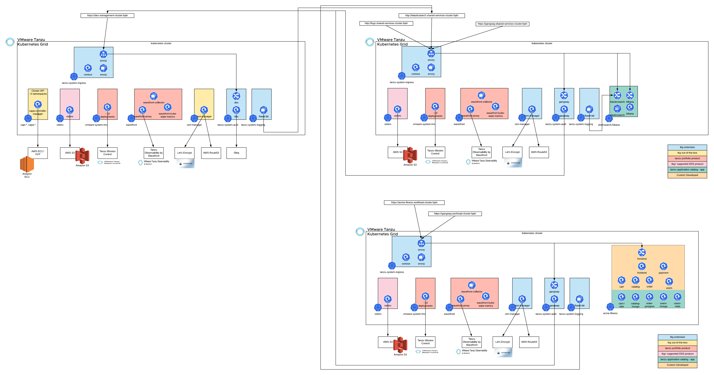

# TKG Lab



In this lab, we will deploy Tanzu Kubernetes Grid (standalone deployment model) to AWS or vSphere.  We will additionally deploy TKG extensions for ingress, authentication, and logging.

OSS Signed and Supported Extensions:

- **Contour** for ingress
- **Dex** and **Gangway** for authentication
- **Fluent-bit** for logging
- **Cert-manager** for certificate management

TKG Plus for additional Open Source Support:

- **Velero** for backup
- **Harbor** for image registry

Incorporates the following Tanzu SaaS products:

- **Tanzu Mission Control** for multi-cluster management
- **Tanzu Observability** by Wavefront for observability

Leverages the following external services:

- **AWS S3** as an object store for Velero backups
- **Okta** as an OIDC provider
- **GCP Cloud DNS / Router 53** as DNS provider
- **Let's Encrypt** as Certificate Authority

## Goals and Audience

The following demo is for Tanzu field team members to see how various components of Tanzu and OSS ecosystem come together to build a modern application platform.  We will highlight two different roles of the platform team and the application team's dev ops role.  This could be delivered as a presentation and demo.  Or it could be extended to include having the audience actually deploy the full solution on their own using their cloud resources. The latter would be for SE’s and likely require a full day.

Disclaimers

- Arguably, we have products, like TAS or TKGI that deliver components of these features and more with tighter integration, automation, and enterprise readiness today.
- Additionally, it is early days in our product integrations, automation, and enterprise readiness as these products have recently entered GA or are being integrated for the first time.

What we do have is a combination of open source and proprietary components, with a bias towards providing VMware built/signed OSS components by default, with flexibility to swap components and flexible integrations.

VMware commercial products included are: TKG, TO, TMC and OSS products.

3rd-party SaaS services included are: AWS S3, AWS Route 53, GCP Cloud DNS, Let's Encrypt, Okta.  Note: There is flexibility in deployment planning.  For instance, You could Swap GCP Cloud DNS with Route53.  Or you could swap Okta for Google or Auth0 for OpenID Connect.

## Scenario Business Context

The acme corporation is looking to grow its business by improving their customer engagement channels and quickly testing various marketing and sales campaigns.  Their current business model and methods can not keep pace with this anticipated growth.  They recognize that software will play a critical role in this business transformation.  Their development and ops engineers have chosen microservices and kubernetes as foundational components to their new delivery model.  They have engaged as a partner to help them with their ambitious goals.

## App Team

The acme fitness team has reached out the platform team requesting platform services.  They have asked for:

- Kubernetes based environment to deploy their acme-fitness microservices application
- Secure ingress for customers to access their application
- Ability to access application logs in real-time as well as 30 days of history
- Ability to access application metrics as well as 90+ days of history
- Visibility into overall platform settings and policy
- Daily backups of application deployment configuration and data
- 4 Total GB RAM, 3 Total CPU Core, and 10GB disk for persistent application data

Shortly after submitting their request, the acme fitness team received an email with the following:
- Cluster name
- Namespace name
- Base domain for ingress
- Link to view overall platform data, high-level observability, and policy
- Link to login to kubernetes and retrieve kubeconfig
- Link to search and browse logs
- Link to access detailed metrics

DEMO: With this information, let’s go explore and make use of the platform…

- Access login link to retrieve kubeconfig (gangway)
- Update ingress definition based upon base domain and deploy application (acme-fitness)
- Test access to the app as and end user (convoy)
- View application logs (kibana, elastic search, fluent-bit)
- View application metrics (tanzu observability)
- View backup configuration (velero)
- Browse overall platform data, observability, and policy (tmc)

Wow, that was awesome, what happened on the other side of the request for platform services?  How did that all happen?


## Required CLIs

- kubectl
- tmc
- tkg
- velero
- helm 3
- yt

## Installation Steps
### Management Cluster
#### 1. [Install Management Cluster](docs/mgmt-cluster/01_install_tkg_mgmt.md)
#### 2. [Attach Management Cluster to TMC](docs/mgmt-cluster/02_attach_tmc_mgmt.md)
#### 3. [Configure DNS and Prep Certificate Signing](docs/mgmt-cluster/03_dns_certs_mgmt.md)
#### 4. [Configure Okta](docs/mgmt-cluster/04_okta_mgmt.md)
#### 5. [Retrieve TKG Extensions](docs/mgmt-cluster/05_extensions_mgmt.md)
#### 6. [Install Contour Ingress Controller](docs/mgmt-cluster/06_contour_mgmt.md)
#### 7. [Install Dex](docs/mgmt-cluster/07_dex_mgmt.md)
#### 8. [Install Tanzu Observability](docs/mgmt-cluster/08_to_mgmt.md)
#### 9. [Install ElasticSearch and Kibana](docs/mgmt-cluster/09_ek_mgmt.md)
#### 10. [Install FluentBit](docs/mgmt-cluster/10_fluentbit_mgmt.md)
#### 11. [Install Velero and Setup Nightly Backup](docs/mgmt-cluster/11_velero_mgmt.md)
#### 12. [Install Harbor Image Registry](docs/mgmt-cluster/12_harbor_mgmt.md)


## Now you have a simulated request to setup cluster for a new team

### Workload Cluster

#### 1. [Create new workload Cluster](docs/workload-cluster/01_install_tkg_wlc.md)
#### 2. [Update Okta for Application Team Users and Group](docs/workload-cluster/02_okta_wlc.md)
#### 3. [Install Contour Ingress Controller](docs/workload-cluster/03_contour_wlc.md)
#### 4. [Install Gangway](docs/workload-cluster/04_gangway_wlc.md)
#### 5. [Attach Workload Cluster to TMC](docs/workload-cluster/05_attach_tmc_wlc.md)
#### 6. [Set policy on Workload Cluster and Namespace](docs/workload-cluster/06_policy_wlc.md)
#### 7. [Install FluentBit](docs/workload-cluster/07_fluentbit_wlc.md)
#### 8. [Install Tanzu Observability](docs/workload-cluster/08_to_wlc.md)
#### 9. [Install Velero and Setup Nightly Backup](docs/workload-cluster/09_velero_wlc.md)

## Now Switch to Acme-Fitness Dev Team Perspective

### Workload Cluster

#### 1. [Log-in to workload cluster and setup kubeconfig](docs/app-team/01-login-kubeconfg.md)
#### 2. [Get, update, and deploy Acme-fitness app](docs/app-team/02-deploy-app.md)


## Teardown

```bash
kubectl delete all,secret,cm,ingress,pvc -l app=acmefit
tmc cluster namespace delete acme-fitness pa-dpfeffer-wlc-1
tmc workspace delete dpfeffer-acme-fitness-dev
tmc cluster delete pa-dpfeffer-mgmt
tmc cluster delete pa-dpfeffer-wlc-1
```

## TODO

- Set network access policy for acme-fitness
- Use bitnami for elasticsearch
